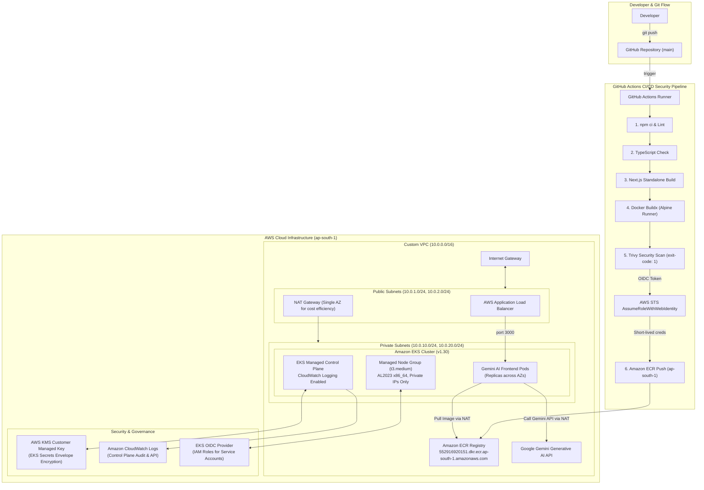

# Gemini DevOps Platform: System Architecture & Infrastructure Design

## Executive Summary
The **Gemini DevOps Platform** is an enterprise-grade AI chat system engineered with Next.js 14, containerized with multi-stage Docker builds on Alpine Linux, scanned for container and dependency vulnerabilities via Aqua Trivy, stored in Amazon ECR via passwordless GitHub Actions OIDC federation, and designed for deployment across a highly available, multi-AZ Amazon Elastic Kubernetes Service (Amazon EKS) cluster in `ap-south-1`.

---

## 1. End-to-End System Architecture



---

## 2. Network Topology & Subnet Breakdown

The network architecture separates untrusted ingress traffic from secure compute workloads:

```
VPC: 10.0.0.0/16 (ap-south-1)
│
├── Availability Zone ap-south-1a
│   ├── Public Subnet A (10.0.1.0/24)
│   │   ├── Internet Gateway Route (0.0.0.0/0 -> igw)
│   │   ├── Elastic IP + NAT Gateway
│   │   └── Ingress ALB Interface
│   │
│   └── Private Subnet A (10.0.10.0/24)
│       ├── NAT Route (0.0.0.0/0 -> nat-gw-1)
│       └── EKS Managed Worker Node 1
│
└── Availability Zone ap-south-1b
    ├── Public Subnet B (10.0.2.0/24)
    │   ├── Internet Gateway Route (0.0.0.0/0 -> igw)
    │   └── Ingress ALB Interface (Multi-AZ Standby)
    │
    └── Private Subnet B (10.0.20.0/24)
        ├── NAT Route (0.0.0.0/0 -> nat-gw-1)
        └── EKS Managed Worker Node 2
```

### Kubernetes Subnet Tagging
* Public subnets are tagged with `kubernetes.io/role/elb = 1` allowing the AWS Load Balancer Controller to automatically discover subnets for public internet-facing Application Load Balancers.
* Private subnets are tagged with `kubernetes.io/role/internal-elb = 1` for internal Kubernetes service load balancers.
* All subnets are tagged with `kubernetes.io/cluster/advanced-gemini-devops-production = shared` for cluster lifecycle discovery.

---

## 3. Security Model & Defense in Depth

| Security Layer | Implementation Mechanism | Security Guarantee |
| :--- | :--- | :--- |
| **Authentication (CI/CD)** | GitHub Actions OIDC (`sts:AssumeRoleWithWebIdentity`) | Zero long-lived AWS keys; cryptographically constrained to repository `itsdev-001/advanced-gemini-devops` on `main`. |
| **Container Scanning** | Aqua Trivy (`exit-code: 1`, `severity: CRITICAL,HIGH`) | Blocking gate in CI halts pipeline on any exploitable vulnerability. |
| **Base Image Hardening** | Multi-stage Docker build on Alpine Linux with `apk upgrade` and stripping of `npm`/`corepack` | 0 base OS CVEs and reduced attack surface. |
| **Compute Isolation** | Private Subnet placement (`map_public_ip_on_launch = false`) | Worker nodes have no public IP addresses and cannot be reached directly from the Internet. |
| **Secret Encryption** | AWS KMS Customer Managed Key | Secrets stored in `etcd` are envelope-encrypted with AES-256 GCM using an automatically rotated KMS key. |
| **Traffic Filtering** | Dual Security Groups (Control Plane SG + Worker Node SG) | Micro-segmented firewall rules enforce least-privilege ingress strictly on ports 443 and 10250. |
| **Audit Logging** | CloudWatch Logs (`api`, `audit`, `authenticator`, `controllerManager`, `scheduler`) | Complete forensics and immutable compliance trails with 30-day retention. |

---

## 4. Disaster Recovery & High Availability

* **Control Plane SLA**: Amazon EKS manages the Kubernetes control plane across at least three AWS Availability Zones, providing a 99.95% uptime SLA.
* **Worker Node Resiliency**: Managed Node Group instances span multiple Availability Zones (`ap-south-1a`, `ap-south-1b`). If an instance or AZ encounters a disruption, Kubernetes scheduling automatically re-provisions pods on healthy nodes in the alternate AZ.
* **Rolling Updates**: `max_unavailable = 1` ensures zero-downtime node upgrades and security patch rolling restarts.

